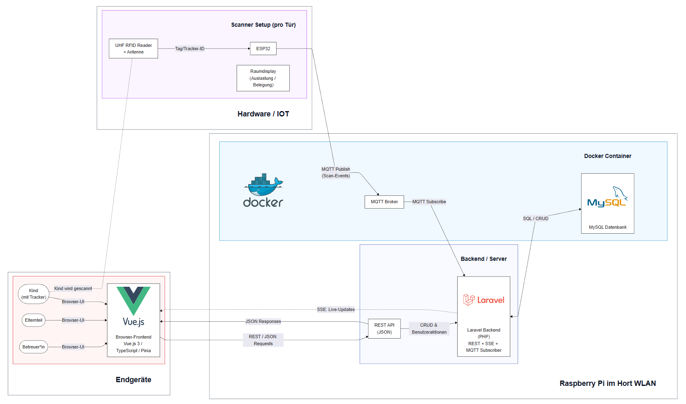

# Lokato – Interaktives Raumdisplay Hort Pregarten

## Projektübersicht

**Title**
Lokato – Interaktives Raumdisplay Hort Pregarten

**Type**
Programming · UX Design / Usability · Web · Media Technology

**Course**
PRO3PT – Semesterprojekt 1
Media Technology and Design Bachelor (MTD.ba)

---

## Team

* **Edina Abazovic** – Technical Lead & Backend Development
* **Selina Catic** – UI/UX Design & Frontend Development
* **Nikolai Hermann** – Hardware & System Integration
* **Tristan Trunez** – Frontend Development

**Supervisors**

* Volker Christian
* Wolfgang Hochleitner

---

## Short Project Description (EN)

The Lokato project is an interactive room display system for the after-school childcare facility *Hort Pregarten*. It replaces an analog magnetic board with a child-friendly digital system that displays room occupancy in real time across multiple devices. By combining contactless, automatic detection with a child-friendly user interface, orientation is improved and daily routines are simplified.

---

## Projektbeschreibung (DE)

Das Projekt **Lokato** ist ein interaktives Raumdisplay für die Betreuungseinrichtung *Hort Pregarten*. Es ersetzt eine analoge Magnettafel durch ein kindgerechtes, digitales System, das die Raumbelegung in Echtzeit auf verschiedenen Endgeräten anzeigt. Durch die Kombination aus kontaktloser, automatischer Erfassung und einer kinderfreundlichen Benutzeroberfläche wird die Orientierung erleichtert und der tägliche Ablauf vereinfacht.

---

## Was ist Lokato?

Lokato unterstützt Betreuungseinrichtungen dabei, die aktuelle Raumbelegung von Kindern übersichtlich und zuverlässig darzustellen. Ziel ist es, den organisatorischen Aufwand im Alltag zu reduzieren und eine klare Orientierung für Kinder und Betreuungspersonal zu schaffen.

Die Erfassung erfolgt kontaktlos über Tracker, die beim Betreten oder Verlassen eines Raumes erkannt werden. Die entstehenden Scan-Ereignisse bilden die Grundlage für eine einfache, visuelle Darstellung der Raumnutzung in Echtzeit.

Der Fokus liegt dabei auf:

* niedriger kognitiver Komplexität
* kindgerechter Darstellung
* Echtzeit-Aktualität
* robuster, wartungsarmer Technik

---

## Systemübersicht (High-Level)

Lokato besteht aus mehreren Komponenten:

* **Hardware / IoT**
  RFID-Scanner und ESP32-Geräte erfassen Scan-Ereignisse an Türen.

* **Backend**
  Verarbeitet Scan-Events, speichert Zustände und stellt APIs bereit.

* **Frontend**
  Visualisiert Raumbelegung und Statusinformationen in Echtzeit.

* **Messaging & Datenhaltung**
  MQTT für Event-Übertragung, relationale Datenbank für Persistenz.

Die folgende Architektur visualisiert diesen Aufbau sowie den Datenfluss vom Scan bis zur Anzeige im Browser.

Dieses Entity-Relationship-Diagramm beschreibt die zugrunde liegende Datenstruktur und deren Beziehungen.

---

## Repository-Struktur

Dieses Repository fungiert als **Main-Repository** des Projekts.

### Inhalt dieses Repositories

* Hardware-nahe Implementierungen (ESP32, Scanner, Displays)
* Projekt- und Systemdokumentation
* Architektur- und Datenmodelle
* Projektkontext (Studium, Zielsetzung, Status)

### Code-Repository für Web & Server

Der gesamte Code für Backend, Frontend und Datenbank befindet sich in einem separaten Repository:

* **`lokato-platform`**
  Backend (Laravel) · Frontend (Vue/Vite) · Datenbank (MySQL)

  Siehe: [lokato-platform](https://github.com/lokato-at/lokato-platform.git)

Dieses Main-Repository enthält **kein** Setup oder Detaildokumentation für diese Komponenten.

---

## Umgebungen

* **Development**
  Lokale Entwicklungsumgebung auf dem Laptop/PC der Entwickler:innen.

* **Produktion**
  Betrieb auf einem Raspberry Pi im WLAN des Horts.

Die Konfiguration und der Betrieb der Zielumgebung sind separat dokumentiert.

---

## Projektstatus

Lokato befindet sich noch in Entwicklung. Die Kernfunktionalität, automatisierte Erfassung und Visualisierung der Raumbelegung, sind umgesetzt und ein Prototyp des gesamten Setups wurde eingerichtet.

---

## Next Steps / ToDos

### Frontend

* Performance-Optimierung des Frontends

  * Reduktion von Ladezeiten
  * Analyse der REST-Requests seit Einführung von SSE
* Integration des finalen UI-Designs (HTML/CSS)
* Konzeption und Umsetzung einer eigenen UI für Raumdisplays

### Hardware

* Displays in Betrieb nehmen (als Ersatz für ESP32-Steckbrett-Setups)
* Evaluation geeigneter Displays (Browser-Fähigkeit eingeschränkt)
* Zuordnung von Sticker-IDs zu Kindern (in Abstimmung mit Backend & Frontend)

**Optional / experimentell:**

* Entfernung des akustischen Signals am R200-Scanner
* Anpassung der Scanner-Reichweite
* Schutzgehäuse für Verkabelung (Kindersicherheit)

---

