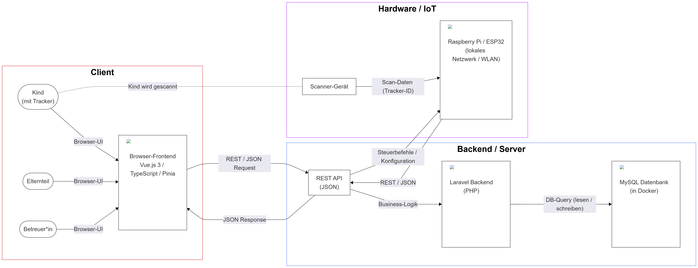

# Lokato – Interaktives Raumdisplay für den Hort Pregarten

Lokato ist ein interaktives, digitales Raumdisplay für den Hort Pregarten.  
Es ersetzt die bisherige Magnettafel und zeigt übersichtlich, welche Kinder sich in welchen Räumen befinden.  
Ziel ist eine leicht bedienbare, robuste Lösung, die den Alltag für Kinder, Pädagog:innen und Hortleitung verbessert.

---

## Inhaltsverzeichnis

- [Lokato – Interaktives Raumdisplay für den Hort Pregarten](#lokato--interaktives-raumdisplay-für-den-hort-pregarten)
  - [Inhaltsverzeichnis](#inhaltsverzeichnis)
  - [Projektüberblick](#projektüberblick)
  - [Zielgruppe \& Ziele](#zielgruppe--ziele)
  - [Features (geplant)](#features-geplant)
  - [Tech-Stack](#tech-stack)
  - [Architektur \& Diagramme](#architektur--diagramme)
    - [Systemübersicht](#systemübersicht)
    - [Systemarchitektur](#systemarchitektur)
    - [Datenmodell](#datenmodell)
    - [User Flow](#user-flow)
  - [Repository-Struktur \& verwandte Repositories](#repository-struktur--verwandte-repositories)
  - [Projektstatus](#projektstatus)
  - [FH-Kontext](#fh-kontext)
  - [Team](#team)
  - [Betreuung](#betreuung)
<!--7. [Installation & Setup](#installation--setup)  -->
<!--8. [Nutzung](#nutzung)-->  
7. [Projektstatus](#projektstatus)  
8. [FH-Kontext](#fh-kontext)  
9. [Team](#team)  
19. [Betreuung](#betreuung)  
<!--13. [Lizenz](#lizenz)  -->

---

## Projektüberblick

Lokato stellt eine zentrale, digitale Übersicht über die Raumbelegung im Hort Pregarten bereit.  
Kinder können eigenständig ihren aktuellen Aufenthaltsort ändern, während Pädagog:innen und Hortleitung jederzeit sehen, wer sich wo befindet.

Das Projekt befindet sich derzeit in der prototypischen Umsetzung und dient gleichzeitig als Studienprojekt im Rahmen des Studiengangs **Medientechnik- und -design**.

---

## Zielgruppe & Ziele

**Zielgruppe**

- Hortleitung
- Pädagog:innen
- (indirekt) hort Kinder
- Betreuer:innen und Lehrende im Rahmen des Studienprojekts

**Ziele**

- Ablöse der analogen Magnettafel durch ein einfach bedienbares, digitales System  
- Erhöhung der Übersichtlichkeit und Transparenz der Raumbelegung  
- Unterstützung der pädagogischen Abläufe (z. B. Sicherheit, Anwesenheitskontrollen)  

---

## Features (geplant)

> **Hinweis:** Viele Punkte sind noch in Konzeption bzw. prototypischer Umsetzung.

- Anzeige der aktuellen Raumbelegung auf einem zentralen Display  
- Selbstständige Umbuchung der Kinder auf andere Räume  
- Konfigurierbare Räume und Gruppen  
- (Optional) Admin-Ansicht für Pädagog:innen / Hortleitung  
- (Optional) Auswertungen / Statistiken zur Nutzung  

---

## Tech-Stack

**Frontend**

- [Vue.js 3](https://vuejs.org/)  
- TypeScript

**Backend**

- [Laravel](https://laravel.com/) (PHP)

**Datenbank**

- MySQL  
- Betrieb in Docker-Containern

**Infrastructure & Tools**

- Docker (Containerisierung)  
- CI/CD via GitHub Actions (in Planung)  
- Figma (UI-/UX-Design)

**Hardware**

- Noch offen / in Evaluierung

---

## Architektur & Diagramme

### Systemübersicht

Übersicht über die wichtigsten Komponenten (Eingabegeräte, Plattform, Display) und deren Zusammenspiel im Hort-Alltag.

TODO

### Systemarchitektur

Darstellung der technischen Architektur (Frontend, Backend, Datenbank, ggf. Hardware-Schicht).

---

### Datenmodell

Überblick über die wichtigsten Entitäten und deren Beziehungen.

---

### User Flow

Ablauf aus Sicht eines Kindes (Raumwechsel) bzw. aus Sicht der Pädagog:innen.

---

## Repository-Struktur & verwandte Repositories

Dieses Repository (`lokato-main`) dient als **zentrales Projekt- und Dokumentations-Repository** für:

* Projektbeschreibung, Ziele und Anforderungen
* Architektur- und Ablaufdiagramme
* Projektdokumentation
* ggf. Präsentationen und weitere Unterlagen
* Hardware Code & Setup

Frontend, Backend und Datenbank liegen in einem separaten Repository:

* **lokato-platform**
  `https://github.com/lokato-at/lokato-platform.git`

---

## Projektstatus

* **Status:** In Arbeit
* **Charakter:** Prototyp / Experimentell / Proof of Concept

Das System ist aktuell in aktiver Entwicklung und noch nicht für den produktiven Einsatz freigegeben.
Änderungen an Architektur, UI und Funktionsumfang sind zu erwarten.

---

## FH-Kontext

Dieses Projekt entsteht im Rahmen des Studiengangs **Medientechnik- und -design**
an der Fachhochschule Hagenberg.

**Lehrveranstaltung**

* **PRO3SE: Project Management and Presentation**

---

## Team

* **Abazovic Edina** – Entwicklung & Konzeption (flexible Rolle)
* **Catic Selina** – Entwicklung & Konzeption (flexible Rolle)
* **Hermann Nikolai** – Entwicklung & Konzeption (flexible Rolle)
* **Trunez Tristan** – Entwicklung & Konzeption (flexible Rolle)

---

## Betreuung

**FH-Betreuung**

* **Hochleitner Wolfgang** – Betreuer
* **Volker Cristian** – Betreuer

**Kontaktperson im Hort**

* /
