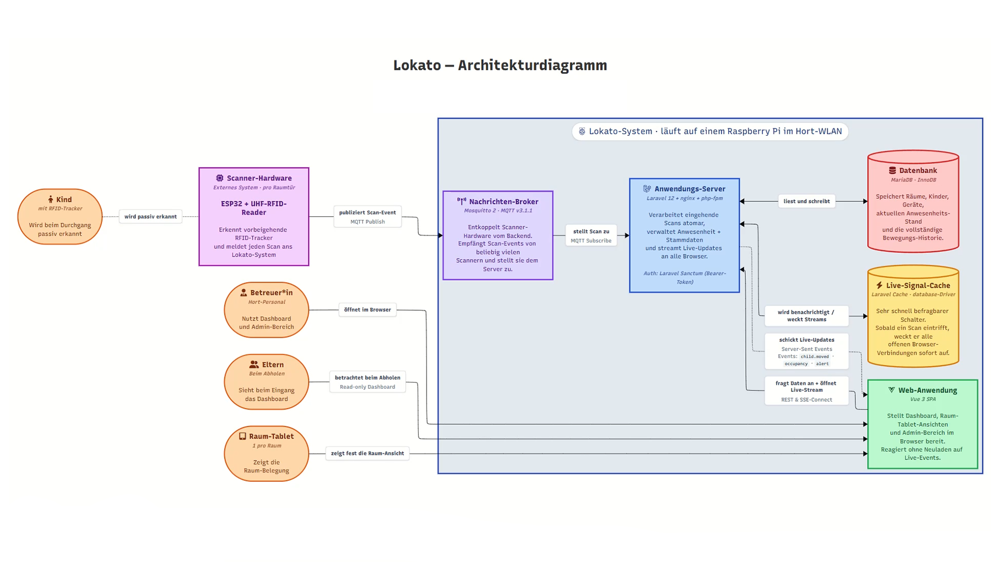
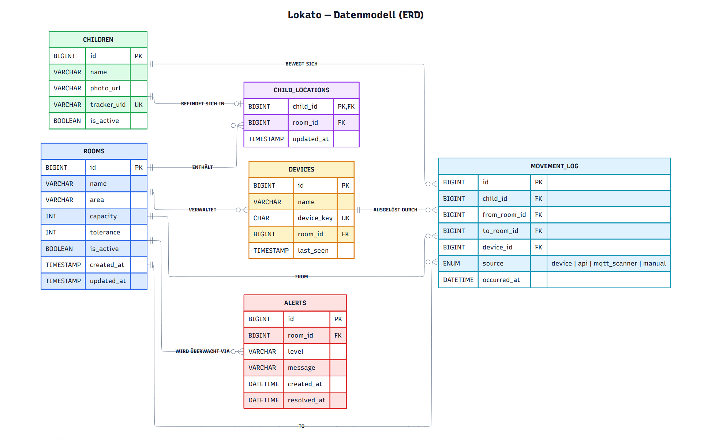

# Lokato

> Real-time room-occupancy display for after-school childcare facilities.
> Children walk through doors, RFID scanners pick up their trackers, and a
> dashboard plus per-room tablets stay in sync — no manual magnet board, no
> page reloads, no cloud.

[](LICENSE)
[](https://www.espressif.com/en/products/socs/esp32)
[](https://www.raspberrypi.com/)
[](#project-status)

This repository is the **hardware + project hub**. The Laravel backend and
Vue frontend live in a separate repo:
**[`lokato-platform`](https://github.com/lokato-at/lokato-platform)**.

---

## Table of contents

- [Lokato](#lokato)
  - [Table of contents](#table-of-contents)
  - [What Lokato is](#what-lokato-is)
    - [Why it exists](#why-it-exists)
    - [Project description (Deutsch)](#project-description-deutsch)
  - [Features](#features)
  - [Architecture](#architecture)
  - [Data model](#data-model)
  - [Repository structure](#repository-structure)
    - [Related repository](#related-repository)
  - [Hardware](#hardware)
    - [Firmware configuration](#firmware-configuration)
  - [Getting started](#getting-started)
    - [1. Backend, frontend \& database — `lokato-platform`](#1-backend-frontend--database--lokato-platform)
    - [2. Raspberry Pi production deployment](#2-raspberry-pi-production-deployment)
    - [3. Hardware (this repo)](#3-hardware-this-repo)
  - [Project status](#project-status)
  - [Roadmap](#roadmap)
    - [Frontend](#frontend)
    - [Hardware](#hardware-1)
    - [Optional / experimental](#optional--experimental)
  - [Team](#team)
  - [License](#license)

---

## What Lokato is

Lokato replaces an analog magnet board in an after-school childcare facility
with a digital, real-time view of which child is in which room. Each room
door has an RFID scanner; when a child walks past, their tracker is read and
the system updates every connected screen within ~500 ms — no reload, no
polling, no extra clicks for staff.

The system is designed for **a single facility on a LAN**, runs on a single
Raspberry Pi, and needs **no cloud, no Redis, no WebSocket daemon**. The
goal is robust, low-maintenance technology that holds up in a real-world
childcare environment.

### Why it exists

| User | Device | What they see |
|---|---|---|
| Staff (Hort-Personal) | Tablet or PC | Live dashboard of all rooms + admin area |
| Per-room tablet | Wall-mounted screen | Live occupancy of that one room, with photos |
| Parents (optional) | Shared entrance tablet | Read-only "who is here" overview |

### Project description (Deutsch)

Lokato ist ein interaktives Raumdisplay für die Betreuungseinrichtung
*Hort Pregarten*. Es ersetzt eine analoge Magnettafel durch ein
kindgerechtes, digitales System, das die Raumbelegung in Echtzeit auf
verschiedenen Endgeräten anzeigt. Die Erfassung erfolgt kontaktlos über
RFID-Tracker, die beim Betreten oder Verlassen eines Raumes erkannt werden.

Der Fokus liegt auf niedriger kognitiver Komplexität, kindgerechter
Darstellung, Echtzeit-Aktualität und robuster, wartungsarmer Technik.

---

## Features

- **Live updates** via Server-Sent Events — dashboard and tablets sync
  within ~500 ms of a scan, no page reload
- **Admin area** for managing rooms, children and devices, including a
  per-child photo upload
- **Capacity & tolerance logic** with warn / over-capacity indicators that
  count up and down live
- **Authentication** for staff (Laravel Sanctum bearer tokens)
- **Branding via config file** — facility name, logo, primary color and
  welcome animations are swappable without a rebuild
- **Same-origin architecture** — one nginx serves frontend and API. If the
  Pi changes IP, only the bookmarks need updating; no `npm run build`
- **Audit log + export** for movement and attendance history
- **LAN-only deployment** — no public internet exposure, no cloud, no
  Redis, no third-party services required at runtime

---

## Architecture

The data flows one direction: an ESP32 scanner publishes a scan via MQTT,
the Laravel subscriber writes the movement atomically to MariaDB, and an
SSE stream pushes the change to every connected browser.



| Layer | Technology |
|---|---|
| Hardware / IoT | ESP32 + R200 UHF-RFID reader, passive EPC Gen2 tags |
| Message bus | Mosquitto 2 (MQTT) |
| Backend | Laravel 12, PHP 8.2+ |
| Frontend | Vue 3 + TypeScript + Pinia + Vite |
| Realtime | Server-Sent Events (single endpoint, cache-gated polling) |
| Database | MariaDB (Pi) / MySQL 8 (dev) |
| Reverse proxy | nginx (Docker in dev, native on the Pi) |
| Cache / session / queue | `database` driver — no Redis required |

The detailed architecture rationale and real-time analysis (cache-gating,
SSE rotation, performance targets) lives in the platform repo:
[`docs/ECHTZEIT_ANALYSE.md`](https://github.com/lokato-at/lokato-platform/blob/main/docs/ECHTZEIT_ANALYSE.md).

---

## Data model



Six core entities: `rooms`, `children`, `devices`, `child_locations`
(current state, one row per child), `movement_log` (append-only history),
and `alerts`. The full schema with column types, foreign keys and indexes
is defined by the Laravel migrations in the platform repo.

---

## Repository structure

```
lokato-main/
├── docs/diagrams/         Architecture + ER diagrams (PNG, SVG, Mermaid source)
├── esp32_rfid_mqtt_prod/  Production firmware: Arduino sketch + R200 driver
├── scripts/               Raspberry Pi setup script + tutorial
├── tablet_mockup/         Static HTML/JS mock-up of the per-room tablet UI
├── project_infos/         Internal project documents (semester-project context)
├── lokato_UI_UX.fig       Figma source file for the UI/UX design
├── LICENSE                MIT
└── README.md              You are here
```

### Related repository

| Repo | What's in it |
|---|---|
| **`lokato-main`** (this) | Hardware firmware, Pi setup, mockups, diagrams |
| **[`lokato-platform`](https://github.com/lokato-at/lokato-platform)** | Laravel backend + Vue frontend + Docker dev stack + Pi deploy script |

---

## Hardware

| Component | Notes |
|---|---|
| ESP32 (classic) | One per scanner — one per room door |
| R200 UHF-RFID reader + antenna | 860–960 MHz, passive EPC Gen2 tags |
| RFID tracker tag | One per child, attached to clothing or school bag |
| Raspberry Pi 4 or 5 (Pi OS 64-bit, Bookworm) | Hosts MQTT + Laravel + MariaDB + nginx |
| Tablets | Any HTML5 browser; one per room, plus a shared entrance tablet |

### Firmware configuration

Each scanner needs its own credentials. Open
[`esp32_rfid_mqtt_prod/esp32_rfid_mqtt_prod.ino`](esp32_rfid_mqtt_prod/esp32_rfid_mqtt_prod.ino)
and set:

```cpp
static const char* DEVICE_KEY    = "<unique-per-scanner>";   // matches devices.device_key in DB
static const char* WIFI_SSID     = "<your-network>";
static const char* WIFI_PASSWORD = "<network-password>";
static const char* MQTT_HOST     = "<pi-ip-on-lan>";
```

> **Don't commit real credentials.** The `.ino` file with placeholders is
> tracked; modified copies belong in `.gitignore`. See
> [`esp32_rfid_mqtt_prod/README_PROD.md`](esp32_rfid_mqtt_prod/README_PROD.md)
> for the full firmware setup, range tuning notes, and the R200 driver API.

---

## Getting started

The two halves of the project are deployed independently:

### 1. Backend, frontend & database — `lokato-platform`

```bash
git clone https://github.com/lokato-at/lokato-platform
cd lokato-platform

# Local development (Docker Compose, Windows / Mac / Linux)
docker compose up -d
cd frontend && npm install && npm run dev
# App opens at http://localhost
```

See the platform repo's [`docs/DEVELOPMENT.md`](https://github.com/lokato-at/lokato-platform/blob/main/docs/DEVELOPMENT.md)
for the full setup with troubleshooting.

### 2. Raspberry Pi production deployment

```bash
git clone https://github.com/lokato-at/lokato-platform /var/www/lokato
cd /var/www/lokato
sudo PI_IP=192.168.1.100 ./start-prod-raspi.sh
```

Native install (no Docker on the Pi), idempotent. Detailed walkthrough:
[`docs/PRODUCTION.md`](https://github.com/lokato-at/lokato-platform/blob/main/docs/PRODUCTION.md).

### 3. Hardware (this repo)

1. Wire the R200 reader to the ESP32 (see `esp32_rfid_mqtt_prod/README_PROD.md`)
2. Configure the firmware as shown above and flash it via Arduino IDE / PlatformIO
3. Add a matching row to the `devices` table via the admin area
4. Walk past with a registered tag — the movement appears within ~500 ms

For the Pi-side OS preparation (separate from the platform setup script),
see [`scripts/rpi-setup-tutorial.md`](scripts/rpi-setup-tutorial.md).

---

## Project status

Lokato is a **functioning prototype** deployed on a Raspberry Pi. The
core flow — RFID scan → MQTT → Laravel → MariaDB → SSE → browser — is
implemented end-to-end and has been tested on-site at a real childcare
facility.

What works in production:
- Live attendance tracking with sub-second update latency
- Full admin CRUD for rooms, children, and devices (with photo upload)
- Capacity warnings and over-capacity alerts that update live
- Authentication for staff; admin endpoints are token-protected
- Nightly automatic reset of attendance state via cron
- Log audit tool with optional email alerts on anomalies

---

## Roadmap

### Frontend
- Animation and accessibility polish on the tablet view

### Hardware
- Streamline sticker-ID to child mapping (with backend & frontend)

### Optional / experimental
- Protective enclosures for wiring (child safety)

---

## Team

| Name | Role |
|---|---|
| **Edina Abazovic** | Technical Lead & Backend Development |
| **Selina Catic** | UI/UX Design & Frontend Development |
| **Nikolai Hermann** | Hardware & System Integration |
| **Tristan Trunez** | Frontend Development |
| **Katharina Binder** | Branding, Animations & 3D Printing |
| **Dorottya Mátrai** | UI/UX Concept & Frontend Implementation |

**Supervisors:** Volker Christian, Wolfgang Hochleitner

**Context:** Bachelor semester project (PRO3PT — Semesterprojekt 1) in the
Media Technology and Design programme at **FH OÖ, Campus Hagenberg**
(winter semester 2025 / summer semester 2026).

---

## License

[MIT](LICENSE) — free to use, modify, and redistribute. No warranty.

Originally developed in partnership with a real after-school childcare
facility (*Hort Pregarten*); deployed and tested on-site.
